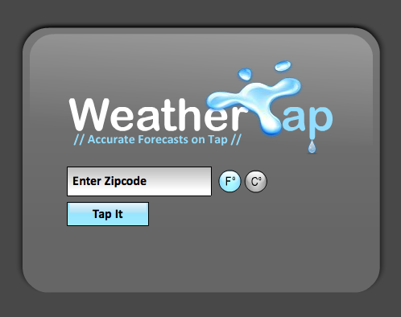
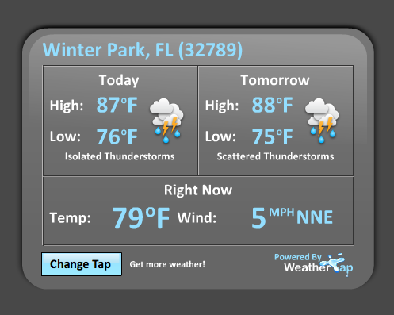

# First release

The app uses the Yahoo Weather API (project req.) to pull in data based on zipcode. Because Yahoo will soon stop supporting queries by zipcode, I also wrote a custom zipcode to WOEID converter, which uses YQL, to ensure the app would remain functional going forward. The app also validates against a list of valid U.S. zipcodes.

This project was completed in 2 days using Actionscript/Flex.

